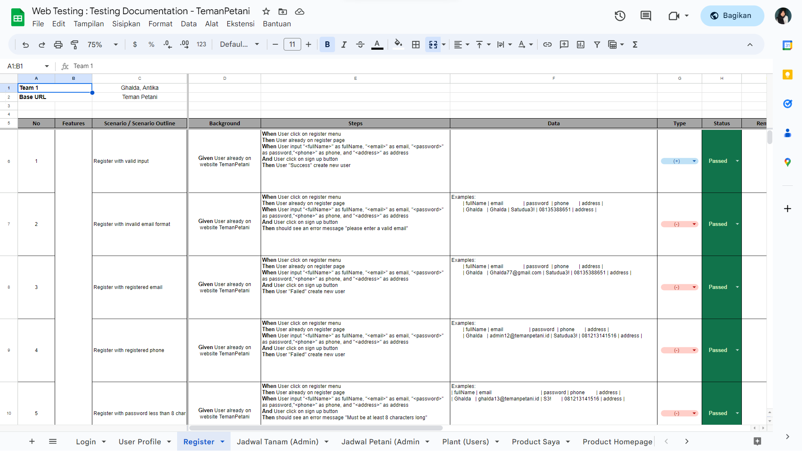
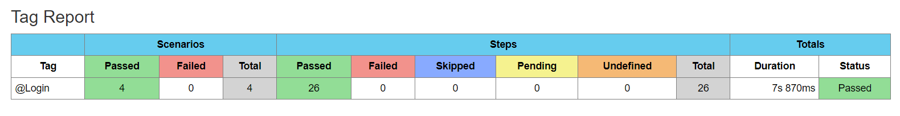
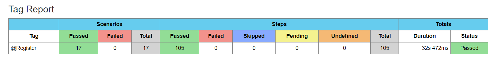
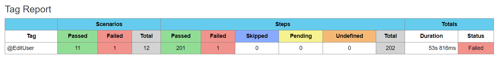
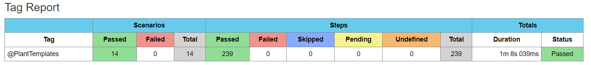
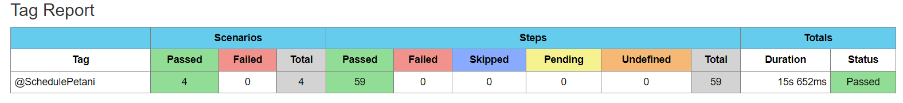
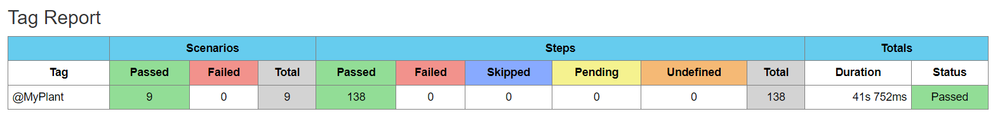
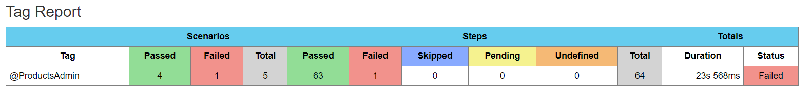
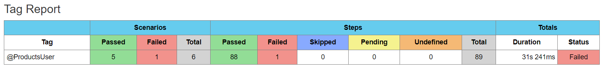
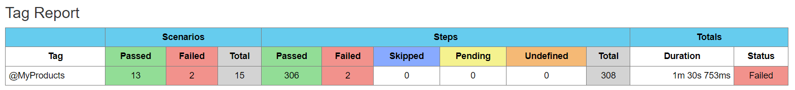

# API Automation Testing : TemanPetani

QE Batch 10 Capstone Project at Altera Academy

## Table of Contents

- [About](#about)
- [Test Documentation](#test-documentation)
- [Test Report](#test-report)
- [Test Coverage](#test-coverage)
- [Tools & Tech Stack](#tools--techstack)
- [Installation](#installation)
- [Author](#author)

## About

[Teman Petani App](https://teman-petani-web.vercel.app/) is a web application that aims to facilitate access to agricultural resources for farmers. With this platform, it can help farmers improve crop yields, reduce distribution costs, and increase profits.

## Test Documentation

Test Documentation Web Testing can access [here](https://docs.google.com/spreadsheets/d/1HxIm0A0Ox-4vBJg3HbHxuppSuqoqwjwuUPNeZeDZaak/edit?usp=sharing).


## Test Report

## Test Coverage
- **Login**


- **Register** 


- **Edit User Profile**


- **Jadwal Tanam**


- **Jadwal Petani**


- **Plant**


- **Products Admin**


- **Products User**


- **My Products**


## Tools & Tech Stack
- [Java 8](https://www.oracle.com/java/technologies/downloads/#java8)
- [Selenium](https://www.selenium.dev/)
- [SerenityBDD](https://serenity-bdd.info/)
- [IntelliJ IDEA](https://www.jetbrains.com/idea/download/)
- IntelliJ IDEA Plugins :  [Cucumber for Java](https://plugins.jetbrains.com/plugin/7212-cucumber-for-java), [Gherkin](https://plugins.jetbrains.com/plugin/9164-gherkin)
- [Maven](https://maven.apache.org/download.cgi)

## Installation
- Install  [Java 8](https://www.oracle.com/java/technologies/downloads/#java8) and [Maven](https://maven.apache.org/download.cgi) on your device
- We recommended you run this project in IntelliJ IDEA and make sure to install Maven and Cucumber for Java and Gherkins first
- Clone project on your device
```
git clone https://github.com/TemanPetani/TemanPetani-WebTest.git
```
- Open IntelliJ IDEA and the project on your device
- For Run Automation Testing
```
mvn clean verify
```

## Author

[](https://github.com/ghalda)
[](https://github.com/Zuniantika)